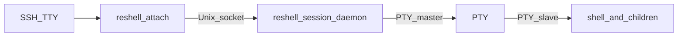

# Design

reshell keeps an interactive shell (and its children) alive after the SSH client
disconnects, then lets you reattach later. It is intentionally closer to
`abduco` / `dtach` than to `tmux`: one PTY per session, no windows/tabs, and no
prefix key chord that steals shortcuts from nested TUIs.

## Goals

- Survive SSH hangup: client exit or `SIGHUP` must not kill the session shell.
- Minimal input interception: only **Ctrl+\** (ASCII `0x1c`) detaches the client.
- Explicit sessions: `new`, `attach`, `list`, `kill` — no transparent SSH wrap in v1.
- Shell-agnostic: PTY passthrough so bash, zsh, fish, and full-screen apps work.
- Linux servers only (`linux-64` pixi platform).

## Non-goals (v1)

- Window splitting, tabs, or status bars
- Scrollback capture / session logging (no frame buffer; apps must redraw on attach)
- Multi-client shared attach (second attach is rejected)
- macOS / Windows
- Automatic `reshell ssh …` wrapper

## High-level architecture



Three OS processes matter after `reshell new`:

| Process | Role |
|---------|------|
| CLI parent (`new`) | Forks the daemon, waits on a readiness pipe, then exits |
| Session daemon | Owns the PTY master, Unix listener, and poll loop |
| Shell | Child of the daemon; controlling TTY is the PTY slave |

`reshell attach` is a fourth short-lived process: raw local TTY ↔ socket ↔ daemon.

## Module map

Single crate; binary name `reshell`.

| File | Responsibility |
|------|----------------|
| [`src/main.rs`](../../src/main.rs) | Clap CLI: `new` / `attach` / `list` / `kill`; default shell `/bin/zsh` |
| [`src/session.rs`](../../src/session.rs) | Base dir, name validation, `meta.json`, list/kill, attach lock |
| [`src/server.rs`](../../src/server.rs) | Daemonize, openpty, spawn shell, accept clients, multiplex I/O |
| [`src/client.rs`](../../src/client.rs) | Raw TTY, detach key, `SIGWINCH` / `SIGHUP`, protocol I/O |
| [`src/protocol.rs`](../../src/protocol.rs) | Length-prefixed framing (see [protocol.md](protocol.md)) |
| [`src/termstate.rs`](../../src/termstate.rs) | DEC private mode tracking for restore-on-attach |

## Session storage

Default base directory:

1. `$XDG_RUNTIME_DIR/reshell` if set
2. else `/tmp/reshell-$UID`

Override with `--dir` or `RESHELL_DIR`.

Per session name `$name`:

```
$base/$name/
  meta.json       # name, daemon pid, shell path, created_unix, attached
  session.sock    # Unix domain socket (mode 0600)
  attached        # lock file present while a client is connected
```

Session names are limited to `[A-Za-z0-9._-]`, max 64 characters.

`list` skips directories whose daemon pid is dead and removes stale files.
`kill` sends `SIGTERM` (then `SIGKILL`) to the daemon pid and deletes the session dir.

## Session creation (`new`)

1. Validate name; refuse if a live session with that name already exists.
2. Resolve shell: `--shell <path>` if given, otherwise **`/bin/zsh`** (not `$SHELL`).
3. Create the session directory.
4. `pipe` + `fork`:
   - **Parent:** close write end; block until child writes one readiness byte (or timeout / EOF).
   - **Child:** `setsid`, ignore `SIGHUP`/`SIGINT`/`SIGPIPE`, reopen stdio to `/dev/null`, run the daemon.
5. Daemon `openpty`, forks the shell on the slave (`TIOCSCTTY`, dup2 0/1/2, `exec` shell).
6. Daemon binds `session.sock`, writes `meta.json` (pid = daemon), signals readiness.
7. Parent prints the session name and exits (optionally continues into `attach` with `-a`).

The daemon ignores `SIGHUP` so an SSH disconnect of the creating terminal does not
tear it down. The shell keeps default signal disposition so Ctrl+C reaches it via
the PTY when a client is attached (raw mode sends `0x03` as data).

## Attach / detach

### Attach

1. Require a local TTY on stdin.
2. Refuse if meta missing, daemon dead, or `attached` lock already present.
3. Connect to `session.sock`.
4. Put local TTY in raw mode; restore on exit (`TermiosGuard`).
5. Send `Attach` with current winsize; enter poll loop:
   - stdin → `Data` (or `Detach` if Ctrl+\ seen)
   - socket `Data` → stdout
   - `SIGWINCH` → `Resize`
   - `SIGHUP` → send `Detach` and exit (session keeps running)
6. On client exit, write a best-effort DEC mode cleanup sequence (disable mouse /
   alt-screen / bracketed paste) before restoring termios, so the local shell is
   not left with sticky TUI modes.

### Reattach and full-screen apps

reshell does not keep a scrollback or screen buffer. Instead the daemon:

1. Parses PTY output for DEC private modes (alt-screen, mouse tracking, bracketed
   paste, focus events, cursor visibility, …), including while detached.
2. On `Attach`, sends those modes back to the new client as the first `Data`
   payload (so the local TTY enables mouse again, enters alt-screen, etc.).
3. Forces a `SIGWINCH` to the PTY foreground group even when the winsize is
   unchanged (brief size bump + `TIOCGPGRP`/`SIGWINCH`), so TUI apps redraw.

PTY bytes are not forwarded to a client until `Attach` has been processed, so
mode restore runs before any redraw data.

### Detach vs kill

| Event | Client | Daemon | Shell |
|-------|--------|--------|-------|
| Ctrl+\ | exits | drops client, clears attach lock | keeps running |
| SSH hangup (`SIGHUP` to client) | exits after `Detach` | same as above | keeps running |
| Client crash / socket close | gone | drops client | keeps running |
| Shell exits | eventually EOF on socket | cleans up session files, exits | — |
| `reshell kill` | n/a | terminated | terminated with PTY teardown |

Only one client may be attached. A second connection is accepted then immediately
closed by the daemon.

## Daemon I/O loop

The daemon `poll`s:

- PTY master (readable → enqueue framed `Data` for the attached client, if any)
- Listen socket (accept; at most one live client)
- Client socket `POLLIN` / `POLLOUT` (decode frames into an inbound buffer; flush an outbound buffer)

Client sockets are **non-blocking**. Complete frames are encoded into an outbound
byte buffer and written with partial-write retry on `POLLOUT`. This matters for
TUI apps (ratatui/crossterm): a full-screen redraw can exceed the Unix socket
buffer; naive `write_all` on a non-blocking socket used to fail mid-frame,
corrupt the stream, and freeze the attach client.

When the outbound buffer exceeds a high-water mark, the daemon stops reading the
PTY until it drains (backpressure). When no client is attached, PTY output is
still read and discarded (no scrollback in v1), but DEC modes are still updated.
When the shell exits (`waitpid`), the daemon cleans up and exits.

## Packaging and toolchain

Mirrors the csv-utils dual-manifest pattern:

| File | Role |
|------|------|
| `Cargo.toml` / `Cargo.lock` | Rust crate; lockfile used with `--locked` in conda builds |
| `pixi.toml` / `pixi.lock` | Conda env: Rust from conda-forge; tasks; pixi-build |
| `recipe/recipe.yaml` | rattler-build → `$PREFIX/bin/reshell` |
| `scripts/update-version.sh` | CalVer `YYYY.M.D+N` across Cargo / pixi / recipe |

Dev commands go through pixi (`pixi run build`, `pixi run -- cargo …`) so the
conda Rust toolchain is used, not an older system rustup.

## Testing strategy

- Unit tests: protocol roundtrip, session name validation, meta read/write,
  DEC mode parse/restore (`termstate`).
- Integration (`tests/session_smoke.rs`): `new` → speak protocol over the socket →
  detach → reconnect → confirm the same shell is still alive → `kill`.
- Integration (`tests/attach_restore.rs`): child enables mouse/alt-screen → detach →
  reattach observes restored CSI modes and a forced redraw signal path.

Attach’s TTY path is exercised manually or via an external PTY driver; the smoke
test intentionally talks the wire protocol so CI does not need a controlling TTY.
