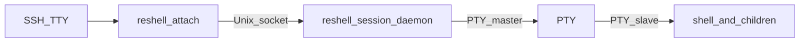

# Design

reshell keeps an interactive shell (and its children) alive after the SSH client
disconnects, then lets you reattach later. It is intentionally closer to
`abduco` / `dtach` than to `tmux`: one PTY per session, no windows/tabs, and no
prefix key chord that steals shortcuts from nested TUIs.

## Goals

- Survive SSH hangup: client exit or `SIGHUP` must not kill the session shell.
- Minimal input interception: only a single detach byte (default **Ctrl+\** /
  ASCII `0x1c`; overridable via `--detach-key` / `RESHELL_DETACH_KEY`).
- Explicit sessions: `new`, `attach`, `list`, `info`, `rename`, `clean`, `kill` —
  no transparent SSH wrap in v1.
- Shell-agnostic: PTY passthrough so bash, zsh, fish, and full-screen apps work.
- Linux servers only (`linux-64` pixi platform).

## Non-goals (v1)

- Window splitting, tabs, or status bars
- VT screen-buffer emulation / multiplexer-style scrollback UI (optional
  byte-ring replay of detached output is supported; apps still redraw on attach)
- Multi-client shared attach (second attach is rejected)
- macOS / Windows
- Automatic `reshell ssh …` wrapper

## High-level architecture



Three OS processes matter after `reshell new`:

| Process | Role |
|---------|------|
| CLI parent (`new`) | Forks the daemon, waits on a readiness pipe, then exits |
| Session daemon | Owns the PTY master, Unix listener, and poll loop |
| Shell | Child of the daemon; controlling TTY is the PTY slave |

`reshell attach` is a fourth short-lived process: raw local TTY ↔ socket ↔ daemon.

## Module map

Single crate; binary name `reshell`.

| File | Responsibility |
|------|----------------|
| [`src/main.rs`](../../src/main.rs) | Clap CLI: `new` / `attach` / `list` / `info` / `context` / `rename` / `clean` / `kill` / `completion` (short aliases `n`/`a`/`ls`/`i`/`c`/`r`/`k`); dynamic session-name completion (`attach` = detached only; flags hidden from Tab; subcommand Tab shows long name + `(alias)` description); detach-key + log + scrollback flags; default shell `/bin/zsh` |
| [`src/picker.rs`](../../src/picker.rs) | Small raw-TTY session picker + name prompt for bare `reshell` / `attach` with no name |
| [`src/session.rs`](../../src/session.rs) | Base dir, name validation, `meta.json`, list/info/rename/clean/kill, attach lock, most-recent / current session |
| [`src/server.rs`](../../src/server.rs) | Daemonize, openpty, spawn shell, accept clients, multiplex I/O, scrollback replay, context snapshots |
| [`src/client.rs`](../../src/client.rs) | Raw TTY, configurable detach key, `SIGWINCH` / `SIGHUP`, protocol I/O, context fetch |
| [`src/protocol.rs`](../../src/protocol.rs) | Length-prefixed framing (see [protocol.md](protocol.md)); context req/res |
| [`src/scrollback.rs`](../../src/scrollback.rs) | Bounded ring of detached PTY bytes; size parsing (`1M`, `512K`) |
| [`src/context.rs`](../../src/context.rs) | Rolling primary-screen lines + OSC 633 last-command for `reshell context` |
| [`src/termstate.rs`](../../src/termstate.rs) | DEC private mode + OSC window-title tracking for restore-on-attach |
| [`src/vscode_si.rs`](../../src/vscode_si.rs) | VS Code/Cursor OSC 633 sticky-scroll + shell-integration inject (bash/zsh/fish) |

## Session storage

Default base directory:

1. `$XDG_RUNTIME_DIR/reshell` if set
2. else `/tmp/reshell-$UID`

Override with `--dir` or `RESHELL_DIR`.

Per session name `$name`:

```
$base/$name/
  meta.json       # name, daemon pid, shell path, created_unix, last_active_unix, attached
  session.sock    # Unix domain socket (mode 0600)
  attached        # flock-backed lock file held while a client is connected
  client.pid      # pid of the interactive attach client (`SO_PEERCRED`); cleared on detach
  switch_to       # optional one-shot target name for in-session switch (`SIGUSR1`)
  daemon.log      # per-session daemon log (startup, attach/detach, errors)
```

Session names are limited to `[A-Za-z0-9._-]`, max 64 characters.
Auto-generated names look like `session-{unix_secs}-{4 hex digits}` so concurrent
`new` calls in the same second do not collide.

`list` skips directories whose daemon pid is dead and removes stale files (also
available explicitly as `reshell clean`). It recovers a leftover `attached` file
when nobody holds the advisory flock (e.g. after a crashed daemon), and removes
orphan session dirs that lack `meta.json`.
`list` shows relative created and last-active times by default (`2h ago`);
`list --json` is stable for scripts (includes `created_unix` / `last_active_unix`).
`info` prints pid, shell, state, timestamps, and all session paths (`info --json` too).
`context` prints the last known command (OSC 633 when present) and ~100 lines of
primary-screen output via a short-lived `ContextReq` (no attach lock, not replayed
into the PTY). With no name, `info` / `context` prefer the session this process is
inside (daemon pid among process ancestors, else `$RESHELL_SESSION`), then the most
recently active session.
`rename old new` renames a live session directory and updates `meta.name`. The
daemon keeps a directory fd open so meta/lock/log writes survive the move; the
Unix socket path moves with the directory.
`kill` sends `SIGTERM` (then `SIGKILL`) to the daemon pid and deletes the session dir.
`kill --all` terminates every live session under the session base dir.
Attach/kill failures include concrete reasons (dead pid, lock held, socket missing, …).

Override the daemon log path with `--log` / `RESHELL_LOG` (fatal errors are written
there; otherwise they go to `daemon.log`).

Detach key defaults to Ctrl+\ (`^\`). Override with `--detach-key` / `RESHELL_DETACH_KEY`
(`^a`, `0x1c`, or a single ASCII character).

Optional detached scrollback: `--scrollback` / `RESHELL_SCROLLBACK` (default `0` =
off; examples `512K`, `1M`; max 16M). Applied when creating a session; replayed on
the next attach after DEC restore + clear.

## Session creation (`new`)

1. Validate name; refuse if a live session with that name already exists.
2. Resolve shell: `--shell <path>` if given, otherwise **`/bin/zsh`** (not `$SHELL`).
3. Create the session directory.
4. `pipe` + `fork`:
   - **Parent:** close write end; block until child writes one readiness byte (or timeout / EOF).
   - **Child:** `setsid`, ignore `SIGHUP`/`SIGINT`/`SIGPIPE`, reopen stdio to `/dev/null`, run the daemon.
5. Daemon `openpty`, forks the shell on the slave (`TIOCSCTTY`, dup2 0/1/2,
   sets `RESHELL_SESSION=<name>`, `exec` shell).
6. Daemon binds `session.sock`, writes `meta.json` (pid = daemon), signals readiness.
7. Parent prints the session name to stderr and **attaches** (default). Pass `--detach` / `-d`
   to create only and print the name on stdout (for scripts / CI).

The daemon ignores `SIGHUP` so an SSH disconnect of the creating terminal does not
tear it down. The shell keeps default signal disposition so Ctrl+C reaches it via
the PTY when a client is attached (raw mode sends `0x03` as data).

## Attach / detach

### Attach

1. Require a local TTY on stdin (for named attach and for the interactive picker).
2. Resolve the session name:
   - Explicit argument → that session.
   - No name + no live sessions + TTY → prompt for a session name (editable
     suggested `session-{unix}-{hex}` default), then create and attach.
   - No name + no live sessions + non-TTY → create with an auto name (same as
     `reshell new`).
   - No name + TTY → interactive picker (first row: **Create new session**, then
     a column header and sessions by recent activity showing name / state /
     created / last-active / shell — detached first, then attached). The session
     this process is inside is marked with `*` (bold). Other attached sessions
     are dimmed. Long names truncate with `…` so columns stay aligned. Cursor
     defaults to the first detachable session when one exists. Keys: ↑/↓ move,
     Enter or `s` attach/switch, `k` kill (y/N confirm), `q` / Esc cancel.
     Choosing create-new prompts for a name (editable `session-{unix}-{hex}`
     default); Esc from the prompt returns to the list. When the picker (or
     `attach <name>`) runs **inside** a session, switch asks the outer attach
     client (`SIGUSR1` + `switch_to`) to detach the current session (freeing
     its attach lock) and attach to the target instead of nesting a second
     client.
   - No name + non-TTY (scripts) → most recently active live session
     (`last_active_unix`, else `created_unix`).
   Bare `reshell` (no subcommand) is an alias for `reshell attach`. When attaching
   to an existing session, prints `attaching to <name>` on stderr before connecting
   (or `switching from <old> to <new>` for an in-session switch).
3. Refuse if meta missing, daemon dead, or an attach flock is already held
   (a leftover `attached` file without a live flock is treated as stale and cleared).
4. Connect to `session.sock`.
5. Put local TTY in raw mode; restore on exit (`TermiosGuard`).
6. Send `Attach` with current winsize; enter poll loop:
   - stdin → `Data` (or `Detach` if the configured detach byte is seen)
   - socket `Data` → stdout
   - `SIGWINCH` → `Resize`
   - `SIGHUP` → send `Detach` and exit (session keeps running)
   - `SIGUSR1` → read `switch_to`, send `Detach`, attach to the new session
     (same process / TTY; previous session is freed)
7. On client exit, write a best-effort DEC mode cleanup sequence (disable mouse /
   alt-screen / bracketed paste) before restoring termios, so the local shell is
   not left with sticky TUI modes.

`last_active_unix` is updated whenever a client attaches or detaches.

### VS Code / Cursor sticky scroll

VS Code sticky scroll follows **OSC 633** shell-integration command markers, not
the OS process tree. Running `reshell` leaves the outer shell’s “current command”
open, so the sticky line stays on `reshell`.

reshell fixes that when `TERM_PROGRAM` is `vscode` (or Cursor is detected):

1. **On attach**, the client writes `OSC 633;D` to the local TTY to finish the
   outer `reshell` command so sticky scroll can move on.
2. **On session create**, the daemon injects VS Code’s shell-integration script
   into bash (`--init-file`), zsh (`ZDOTDIR` + `VSCODE_INJECTION=1`), or fish
   (`--init-command 'source …'`) when it can locate the script
   (`code`/`cursor --locate-shell-integration-path`, or a `.vscode-server` /
   `.cursor-server` install). The session shell then emits `A/B/E/C/D` for each
   command; those bytes pass through the PTY pipe unchanged.
3. Sessions created outside VS Code still work if the user’s rc manually sources
   shell integration when `TERM_PROGRAM=vscode`.

This is the same model as dtach/abduco (raw passthrough), not tmux (which must
DCS-wrap OSC sequences).

### Reattach and full-screen apps

reshell does not keep a VT screen buffer. Optional `--scrollback` /
`RESHELL_SCROLLBACK` (set at session create) keeps a bounded in-memory ring of
raw PTY bytes while detached and replays them on the next attach — useful for
plain-shell history, not a substitute for TUI redraw. The daemon always:

1. Parses PTY output for DEC private modes (alt-screen, mouse tracking, bracketed
   paste, focus events, cursor visibility, …) and the last OSC 0/2 window title,
   including while detached.
2. On `Attach`, sends those modes (and the remembered title) back to the new
   client as the first `Data` payload (so the local TTY enables mouse again,
   enters alt-screen, restores the tab/window title, etc.), then clears the
   local screen.
3. If scrollback is enabled and non-empty, replays captured detached bytes as
   further `Data` frames (then clears the ring).
4. Forces a full child redraw that differential TUIs (notably ratatui/crossterm
   apps such as [fresh](https://github.com/sinelaw/fresh)) will actually emit:
   - Apply a temporary winsize (rows±1) so the app invalidates its previous cell
     buffer and dumps a full frame to the newly attached client.
   - After ~50ms of PTY output (or 250ms max), restore the real winsize for a
     second full paint at the correct geometry.

Instant same-size `SIGWINCH` is not enough: fresh redraws in memory, but
crossterm only writes cells that differ from its previous buffer, so a blank
reattach TTY stays blank until the user moves the mouse over dirty regions.

PTY bytes are not forwarded to a client until `Attach` has been processed, so
mode restore (and optional scrollback replay) runs before live redraw data.

### Detach vs kill

| Event | Client | Daemon | Shell |
|-------|--------|--------|-------|
| Detach key (default Ctrl+\) | exits | drops client, clears attach lock | keeps running |
| SSH hangup (`SIGHUP` to client) | exits after `Detach` | same as above | keeps running |
| Client crash / socket close | gone | drops client | keeps running |
| Shell exits | eventually EOF on socket | cleans up session files, exits | — |
| `reshell kill` | n/a | terminated | terminated with PTY teardown |

Only one client may be attached. Exclusivity is enforced by an advisory `flock`
on the `attached` file held by the daemon for the life of the connection: a second
socket is accepted then immediately closed, and `reshell attach` refuses early
when the flock is held. A leftover `attached` file with no flock holder is treated
as stale and cleared.

## Daemon I/O loop

The daemon `poll`s:

- PTY master `POLLIN` (readable → enqueue framed `Data` for the attached client, if any)
- PTY master `POLLOUT` when client→PTY bytes are pending (partial writes resume here;
  no busy-wait on `EAGAIN`)
- Listen socket (accept; at most one live client, with attach flock)
- Client socket `POLLIN` / `POLLOUT` (decode frames into an inbound buffer; flush an outbound buffer)

Client sockets and the PTY master are **non-blocking**. Complete frames are encoded
into an outbound byte buffer and written with partial-write retry on `POLLOUT`.
This matters for TUI apps (ratatui/crossterm): a full-screen redraw can exceed the
Unix socket buffer; naive `write_all` on a non-blocking socket used to fail
mid-frame, corrupt the stream, and freeze the attach client.

When the outbound (client) buffer exceeds a high-water mark, the daemon stops
reading the PTY until it drains (backpressure). When the PTY write buffer is
backed up, the daemon pauses reading the client socket. When no client is
attached (or the client has not yet sent `Attach`), PTY output is still read:
DEC modes are updated, and bytes are pushed into the optional scrollback ring
when `--scrollback` / `RESHELL_SCROLLBACK` is non-zero (otherwise discarded).
When the shell exits (`waitpid`), the daemon cleans up and exits.

## Packaging and toolchain

Mirrors the csv-utils dual-manifest pattern:

| File | Role |
|------|------|
| `Cargo.toml` / `Cargo.lock` | Rust crate; lockfile used with `--locked` in conda builds |
| `pixi.toml` / `pixi.lock` | Conda env: Rust from conda-forge; tasks; pixi-build |
| `recipe/recipe.yaml` | rattler-build → `$PREFIX/bin/reshell` |
| `scripts/update-version.sh` | CalVer `YYYY.M.D+N` across Cargo / pixi / recipe |

Dev commands go through pixi (`pixi run build`, `pixi run -- cargo …`) so the
conda Rust toolchain is used, not an older system rustup.

## Testing strategy

- Unit tests: protocol roundtrip, session name validation, meta read/write,
  DEC mode parse/restore (`termstate`), attach flock exclusivity / stale recovery,
  kill SIGTERM→SIGKILL escalation.
- Integration (`tests/session_smoke.rs`): `new` → speak protocol over the socket →
  detach → reconnect → confirm the same shell is still alive → `kill`.
- Integration (`tests/attach_restore.rs`): child enables mouse/alt-screen → detach →
  reattach observes restored CSI modes; SIGWINCH reporter confirms temporary then
  final winsize (two-phase full paint for differential TUIs).
- Integration (`tests/attach_race.rs`): concurrent attach (one survivor), stale
  `attached` recovery, kill / `kill --all`, missing-session errors, auto-name
  uniqueness, daemon log.
- Shared framing helpers live in `tests/common/` so integration tests stay DRY.

Attach’s TTY path is exercised manually or via an external PTY driver; the smoke
test intentionally talks the wire protocol so CI does not need a controlling TTY.

CI (`.github/workflows/ci.yml`) runs `cargo test --locked` and `pixi run test` on
Linux.
